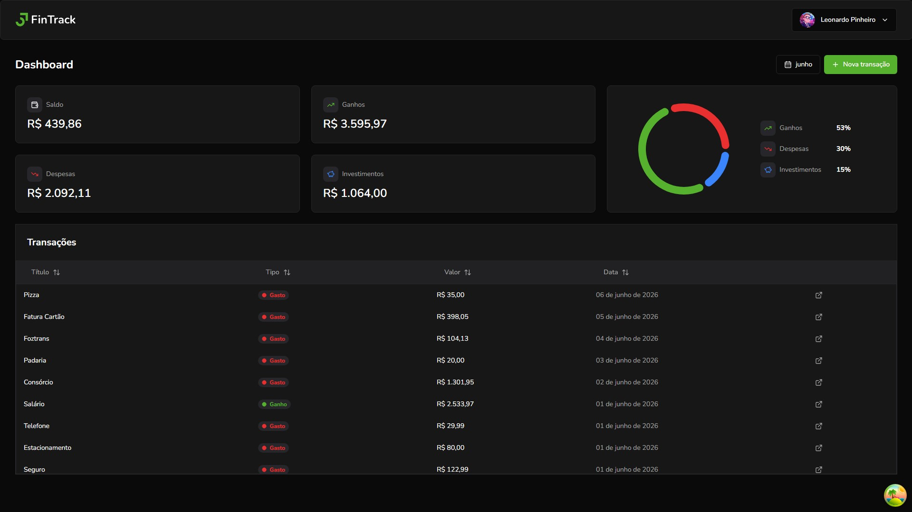
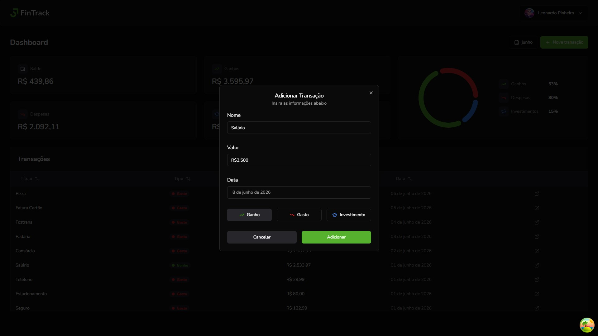
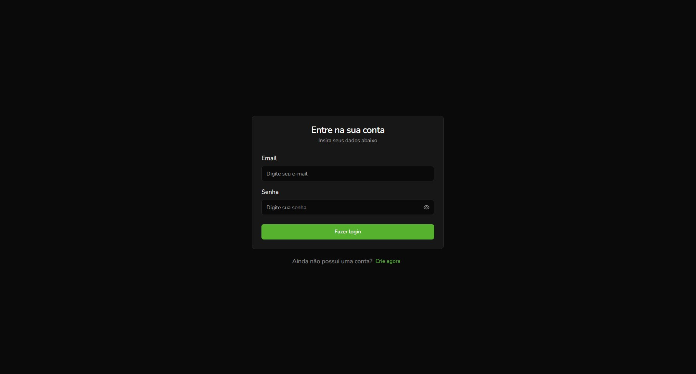
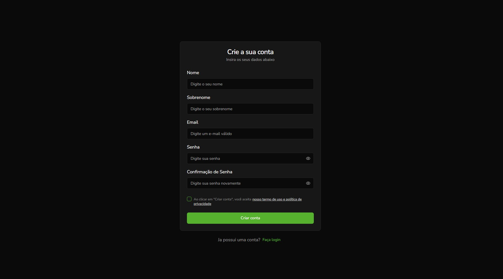

# FinTrack

Aplicação de rastreamento e gerenciamento de transações financeiras construída com React + Vite. Projeto criado para demonstrar conceitos de SPA, componentes reutilizáveis, estilização com Tailwind, autenticação e integração com back-end.



## Tech Stack

- Front-End: React / Vite / Tailwind CSS
- Back-End: Node.js / Express
- Banco: MongoDB / Banco de Dados Relacional

## Principais features

- Autenticação de usuários (login/signup)
- Criar, editar e excluir transações
- Categorização de transações por tipo
- Visualização de balanço geral
- Gráficos de análise de despesas por tipo
- Filtro de transações por data
- Visualização em tabela com dados organizados







## Tecnologias

- React (Hooks, Context API, componentes reutilizáveis)
- Vite (bundler / dev server)
- Tailwind CSS (estilização)
- React Hook Form (gerenciamento de formulários)
- Axios (requisições HTTP)
- React Query ou SWR (gerenciamento de dados)
- ESLint (qualidade de código)
- Shadcn/ui (componentes de UI pré-estilizados)

## Instalação local

- Clone o repositório e entre na pasta:

```bash
git clone https://github.com/leopinheirosilva/fintrack.git
cd fintrack
```

- Instale as dependências

```bash
npm install
```

- Configure as variáveis de ambiente criando um arquivo `.env.local`:

```bash
VITE_API_BASE_URL=http://localhost:3000/api
```

- Rode a aplicação

```bash
npm run dev
```

## Estrutura do Projeto

```
src/
├── components/          # Componentes reutilizáveis
│   └── ui/             # Componentes base de interface
├── pages/              # Páginas principais (Home, Login, Signup)
├── api/                # Hooks e serviços de API
├── forms/              # Formulários e validação com Zod
├── contexts/           # Context API para autenticação
├── helpers/            # Funções auxiliares (datas, moedas)
├── constants/          # Constantes da aplicação
└── assets/             # Imagens e ícones
```

## Deploy

- Vercel

## Contato

Email: <leonardopinheirosilva16@gmail.com>

LinkedIn: <https://www.linkedin.com/in/leonardo-pinheiro-13ba26281/>
